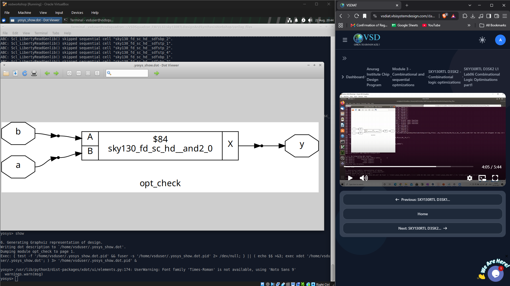
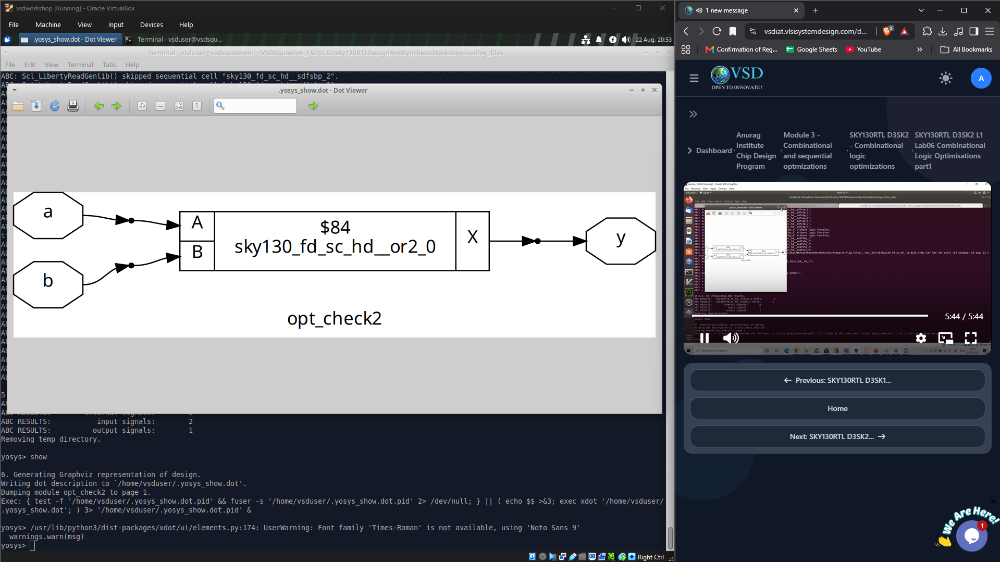
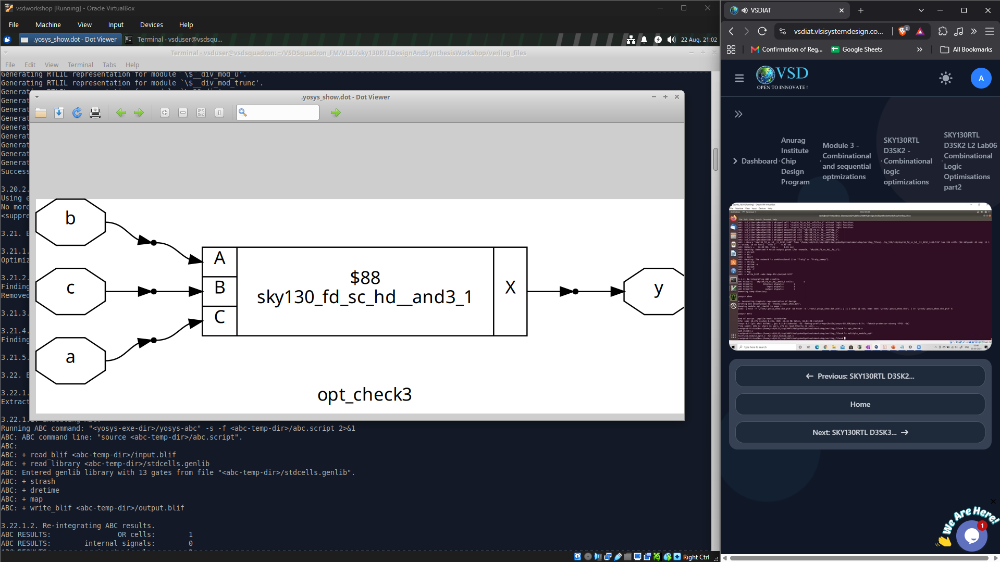

# Lab – Optimisation in Synthesis

## Objective

To understand how Yosys performs logic optimisation during synthesis and how different RTL descriptions can be simplified into equivalent logic gates.

## Optimisation Flow

The following optimisation step was added between synthesis and technology mapping:

```text
synth -top <module>
opt_clean -purge
abc -liberty ../lib/sky130_fd_sc_hd__tt_025C_1v80.lib
```

### `opt_clean -purge`

`opt_clean` removes unused wires and cells from the design. The `-purge` option performs a more aggressive cleanup by removing logic that has become redundant after optimisation.

This step helps ensure that only the logic required for the final functionality is passed to the **ABC technology mapping** stage.

The experiments focused on writing simple conditional RTL expressions and observing how Yosys recognises their Boolean equivalence and simplifies them into standard logic structures.

---

## Optimisation Examples

### 1. `opt_check` – 2-Input AND Gate

RTL:

```verilog
assign y = a ? b : 1'b0;
```

The conditional operator works as a multiplexer:

```text
if a = 1  → y = b
if a = 0  → y = 0
```

This behaviour is equivalent to:

```text
y = a & b
```

Therefore, the objective was to observe whether Yosys could recognise this Boolean relationship and reduce the conditional logic to a **2-input AND gate**.

The resulting cell was:

```text
sky130_fd_sc_hd__and2_0
```



---

### 2. `opt_check2` – 2-Input OR Gate

RTL:

```verilog
assign y = a ? 1'b1 : b;
```

Here:

```text
if a = 1  → y = 1
if a = 0  → y = b
```

This is equivalent to:

```text
y = a | b
```

The objective was to observe whether Yosys could identify this relationship and simplify the conditional logic into a **2-input OR gate**.

The resulting cell was:

```text
sky130_fd_sc_hd__or2_0
```



---

### 3. `opt_check3` – 3-Input AND Gate

RTL:

```verilog
assign y = a ? (c ? b : 1'b0) : 1'b0;
```

The expression contains two nested conditional operations.

For the output to become `1`:

```text
a = 1
c = 1
b = 1
```

Therefore, the expression is equivalent to:

```text
y = a & b & c
```

The objective was to observe whether Yosys could simplify the nested conditional logic into a **3-input AND gate**.

The resulting cell was:

```text
sky130_fd_sc_hd__and3_1
```



---

## Learning Outcomes

- Understood how Yosys performs **RTL-level logic optimisation**.
- Learned how conditional operators can be simplified into equivalent Boolean logic.
- Used `opt_clean -purge` to remove redundant and unused logic.
- Observed how RTL expressions are converted into **Sky130 standard cells**.
- Understood how synthesis optimisation reduces unnecessary logic while preserving functionality.
