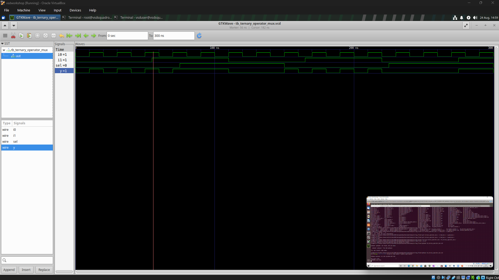
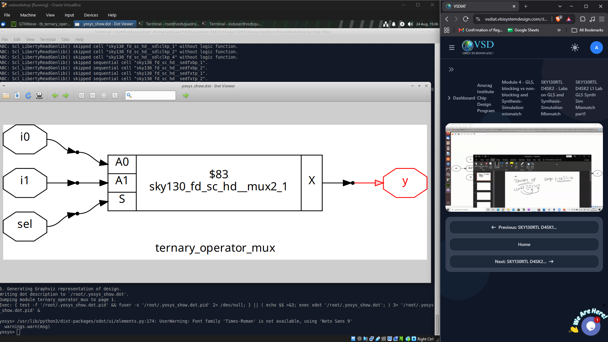
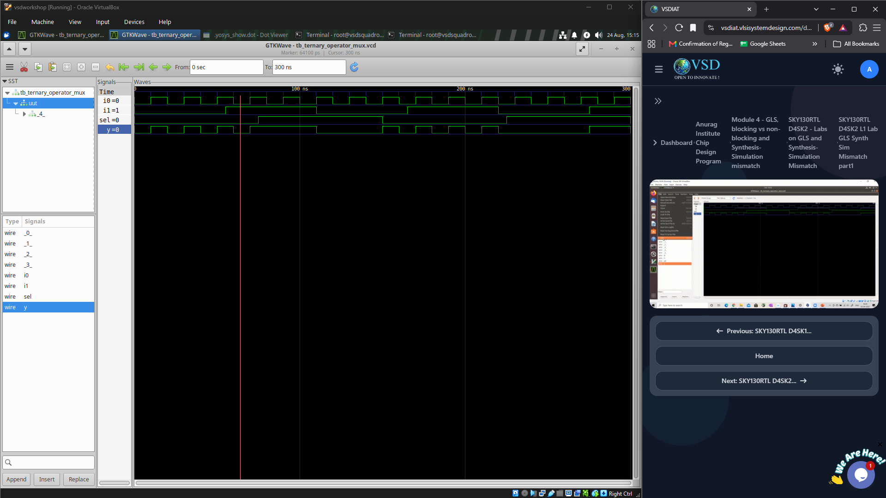
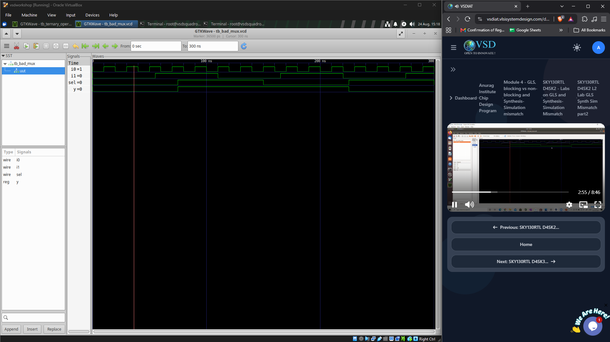
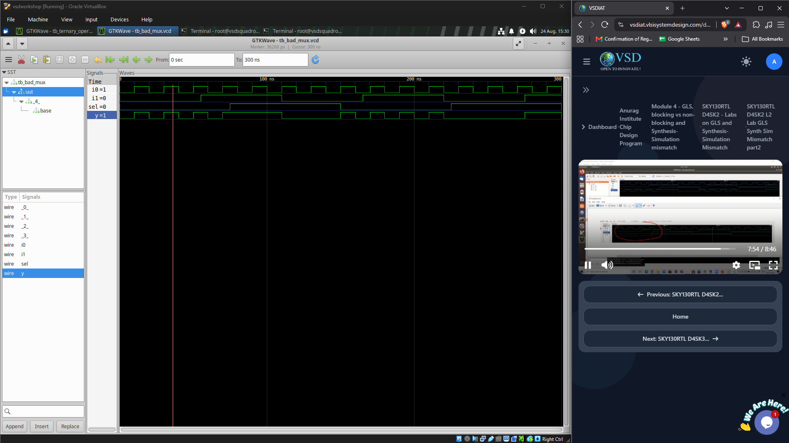

# GLS, Synthesis Simulation and Mismatch

## Objective

To perform **Gate Level Simulation (GLS)** on synthesized Verilog netlists and compare the results with normal RTL simulation.

The lab used two designs:

- `ternary_operator.v`
- `bad_mux.v`

The simulations were performed using **Icarus Verilog** and the output waveforms were analysed using **GTKWave**.

---

## 1. Ternary Operator – Normal RTL Simulation

The first simulation was performed directly on the RTL design and its testbench.

```bash
iverilog ternary_operator.v tb_ternary_operator.v
./a.out
```

The generated waveform was viewed using GTKWave.



The waveform was used to verify the functional behaviour of the ternary operator for different values of:

- `i0`
- `i1`
- `sel`
- `y`

---

## 2. Ternary Operator – Synthesis

The RTL was synthesized using Yosys and a gate-level netlist was generated.

```text
write_verilog -noattr ternary_operator_net.v
```

The synthesized netlist was inspected to understand how the ternary operator was converted into a standard-cell implementation.

The resulting circuit was implemented using a SKY130 multiplexer cell.



The synthesized structure corresponds to the expected multiplexer functionality:

```text
sel = 0  →  y = i0
sel = 1  →  y = i1
```

---

## 3. Ternary Operator – Gate Level Simulation

After generating the synthesized netlist, the SKY130 gate-level Verilog models and primitive definitions were included in the simulation.

The GLS command used was:

```bash
iverilog ../my_lib/verilog_model/primitives.v \
         ../my_lib/verilog_model/<sky130_gate_level_model>.v \
         ternary_operator_net.v \
         tb_ternary_operator.v
```

The simulation was then executed using:

```bash
./a.out
```

The generated waveform was opened in GTKWave.



The gate-level simulation confirmed the functional behaviour of the synthesized multiplexer implementation.

The RTL simulation and GLS output were compared to verify that synthesis had preserved the intended functionality.

---

# 4. Bad MUX – Normal RTL Simulation

The second design used was:

```text
bad_mux.v
```

The design was first simulated directly at RTL level.

```bash
iverilog bad_mux.v tb_bad_mux.v
./a.out
```

The waveform was then analysed using GTKWave.



This provided the reference behaviour of the RTL design before synthesis.

---

# 5. Bad MUX – Gate Level Simulation

The `bad_mux.v` design was synthesized and its gate-level netlist was generated.

The same GLS flow was then used, including the SKY130 primitive and gate-level Verilog models:

```bash
iverilog ../my_lib/verilog_model/primitives.v \
         ../my_lib/verilog_model/<sky130_gate_level_model>.v \
         bad_mux_net.v \
         tb_bad_mux.v
```

The generated simulation was executed using:

```bash
./a.out
```

The resulting waveform was viewed in GTKWave.



The RTL and gate-level waveforms were compared to check whether the synthesized implementation behaved consistently with the original RTL.

---

## 6. RTL Simulation vs GLS

The overall comparison performed in the lab was:

```text
RTL Design
    ↓
RTL Simulation
    ↓
Reference Waveform
```

and:

```text
RTL Design
    ↓
Synthesis
    ↓
Gate-Level Netlist
    ↓
GLS
    ↓
Gate-Level Waveform
```

The final objective was to compare:

```text
RTL Simulation
        ↕
Gate-Level Simulation
```

For a correctly written RTL design, the functional behaviour should remain consistent after synthesis.

---

## 7. Important Observation

The **ternary operator** produced a clear and expected synthesized multiplexer structure.

This demonstrated that:

```verilog
assign y = sel ? i1 : i0;
```

can be synthesized into an appropriate SKY130 multiplexer standard cell.

The `bad_mux` example was used to demonstrate why RTL coding style matters when comparing RTL simulation and synthesized behaviour.

A design may appear correct during RTL simulation, but improper or non-standard coding can create differences between simulation and the synthesized implementation.

---

## 8. Learning Outcomes

- Performed **RTL simulation** using Icarus Verilog.
- Generated and inspected a **synthesized gate-level netlist**.
- Performed **Gate Level Simulation (GLS)** using SKY130 Verilog models.
- Compared RTL and gate-level waveforms using GTKWave.
- Understood how a ternary operator is implemented as a **multiplexer standard cell**.
- Understood the importance of comparing RTL behaviour with the synthesized implementation.
- Observed how poor RTL coding can contribute to **synthesis-simulation mismatch**.
