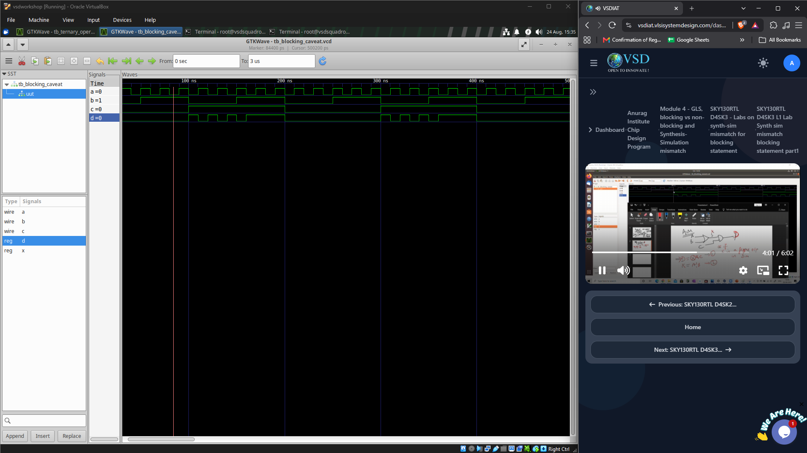
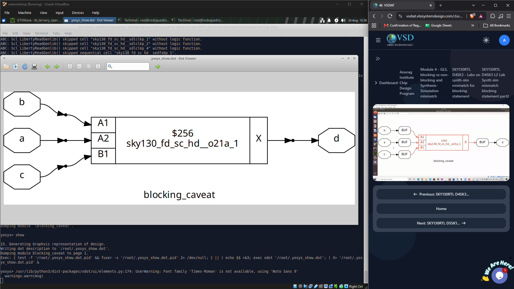
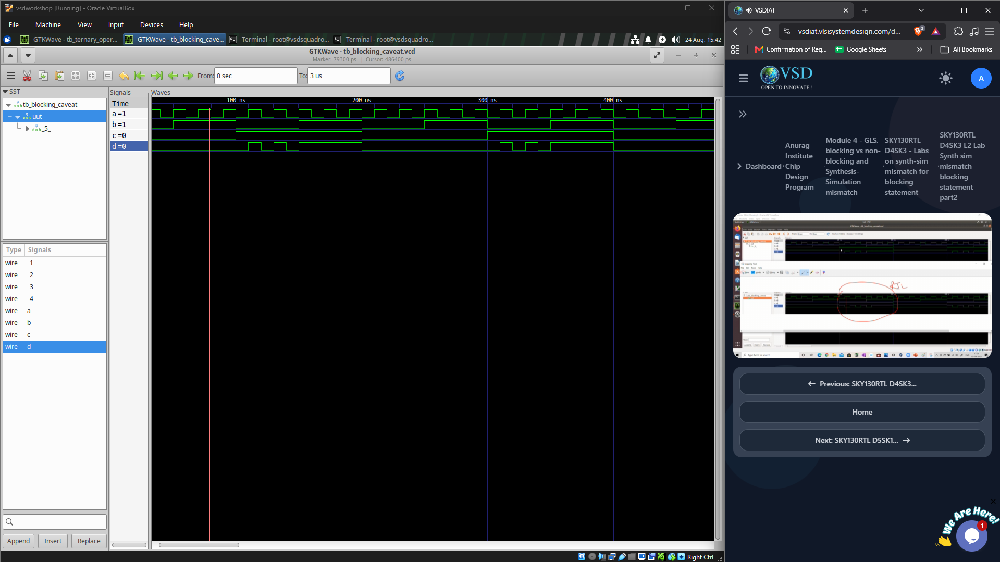

# Lab – Blocking Statement Caveat

## Objective

To understand how the use of **blocking assignments** inside combinational logic can create differences between RTL simulation and synthesized hardware.

The design used in this lab was:

- `blocking_caveat.v`

---

## 1. Blocking and Non-Blocking Assignments

Verilog provides two main procedural assignment operators:

```text
=   → Blocking assignment
<=  → Non-blocking assignment
```

### Blocking Assignment

A blocking assignment executes immediately and in the order in which it appears in the `always` block.

Example:

```verilog
always @(*)
begin
    a = b;
    c = a;
end
```

The simulator executes:

```text
b → a
a → c
```

The second statement sees the updated value of `a`.

Blocking assignments are normally used for **combinational logic**.

### Non-Blocking Assignment

A non-blocking assignment evaluates the right-hand side first and updates the left-hand side after the current procedural evaluation.

Example:

```verilog
always @(posedge clk)
begin
    q1 <= d;
    q2 <= q1;
end
```

Both right-hand sides are evaluated before the registers are updated.

Non-blocking assignments are normally used for **sequential logic**.

```text
Combinational logic → blocking (=)
Sequential logic    → non-blocking (<=)
```

---

## 2. Blocking Caveat

The `blocking_caveat.v` design demonstrates a situation where the order of blocking assignments affects RTL simulation.

The important idea is that the simulator follows the **procedural order of execution**, while synthesis interprets the statements as hardware.

A simplified form of the logic is:

```verilog
always @(*)
begin
    y  = q0 & c;
    q0 = a | b;
end
```

Here, `y` is calculated before `q0` is updated.

Therefore, during RTL simulation:

```text
y uses the previous value of q0
```

while the intended combinational relationship is:

```text
q0 = a | b
y  = q0 & c
```

which can be represented as:

```text
y = (a | b) & c
```

This difference can lead to a **synthesis-simulation mismatch**.

---

## 3. RTL Simulation

The `blocking_caveat.v` design was first simulated at RTL level using the testbench.

The waveform was observed using GTKWave.



The waveform shows the behaviour produced by the simulator according to the procedural ordering of the blocking assignments.

---

## 4. Synthesis

The design was then synthesized using Yosys.

The synthesized result shows that the hardware implementation represents the intended combinational logic rather than the simulator's step-by-step procedural ordering.

The synthesized structure is based on:

```text
a ──┐
    ├── OR ──┐
b ──┘        ├── AND ── d
c ───────────┘
```

The resulting gate-level implementation corresponds to the expected Boolean relationship:

```text
d = (a | b) & c
```



---

## 5. Synthesis-Simulation Mismatch

The mismatch occurs because RTL simulation executes the blocking assignments sequentially:

```text
1. Calculate y using q0
2. Update q0
```

whereas synthesis interprets the statements as combinational hardware relationships.

Therefore:

```text
RTL Simulation
    ↓
Procedural execution order

Synthesis
    ↓
Hardware logic relationships
```

The difference between these interpretations can produce different observed behaviour.



---

## 6. Main Observation

The key lesson from this experiment is that **blocking assignments are not inherently incorrect**, but their ordering must correctly represent the intended combinational dependency.

A safer coding style is to describe signals in their dependency order:

```verilog
always @(*)
begin
    q0 = a | b;
    y  = q0 & c;
end
```

This makes the intended combinational relationship clearer.

---

## 7. Recommended Coding Style

### Combinational Logic

```verilog
always @(*)
begin
    // Combinational logic
    y = expression;
end
```

Use:

```text
Blocking assignment (=)
```

### Sequential Logic

```verilog
always @(posedge clk)
begin
    // Sequential logic
    q <= d;
end
```

Use:

```text
Non-blocking assignment (<=)
```

---

## Learning Outcomes

- Understood the difference between **blocking and non-blocking assignments**.
- Learned how procedural ordering can affect RTL simulation.
- Understood how improper blocking usage can lead to **synthesis-simulation mismatch**.
- Compared RTL simulation with the synthesized gate-level implementation.
- Learned the importance of writing clear and synthesizable **combinational RTL**.
