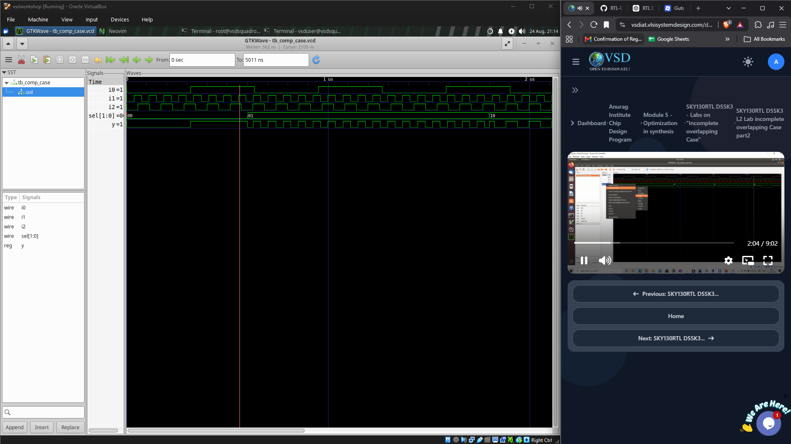
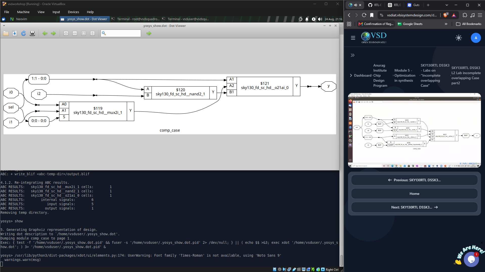
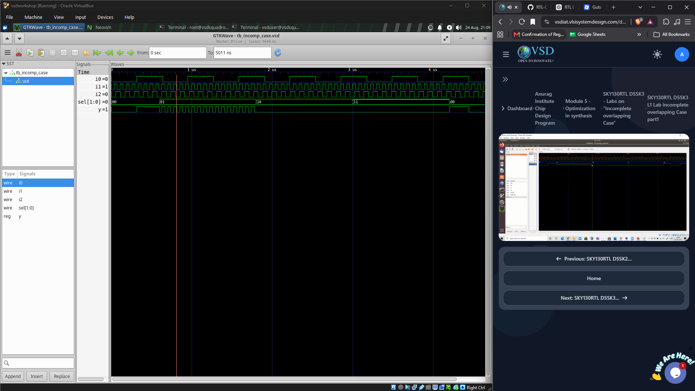
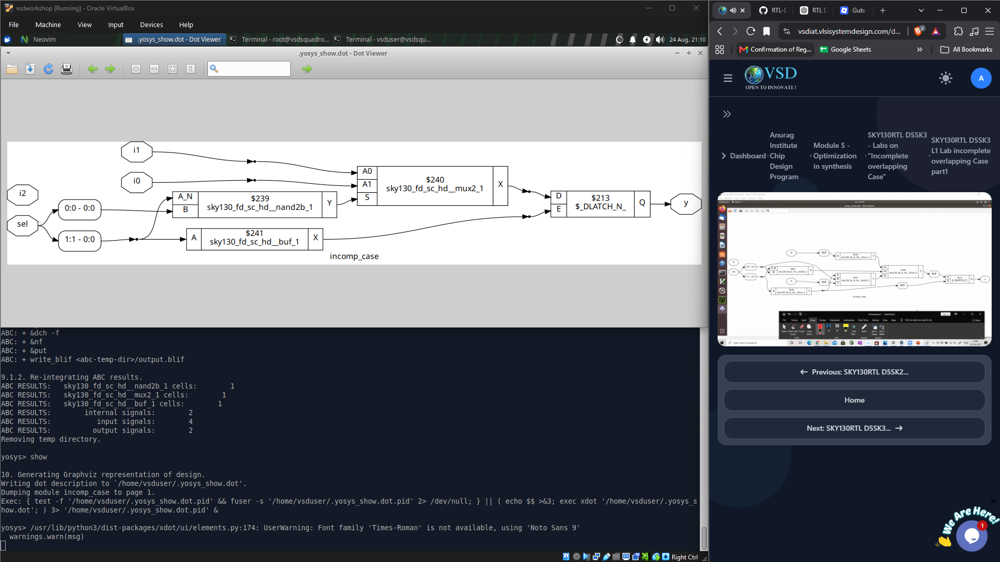
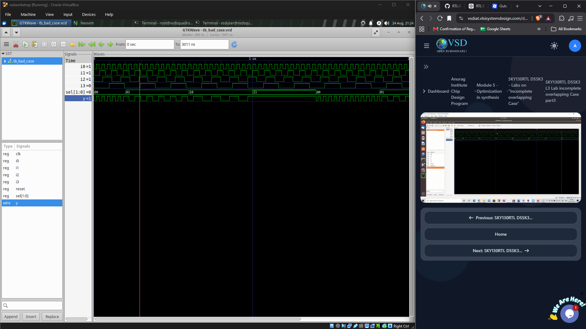
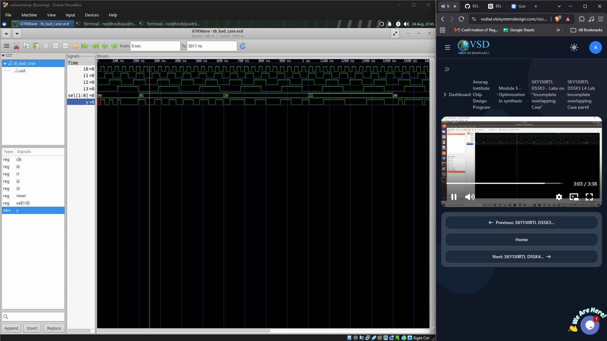
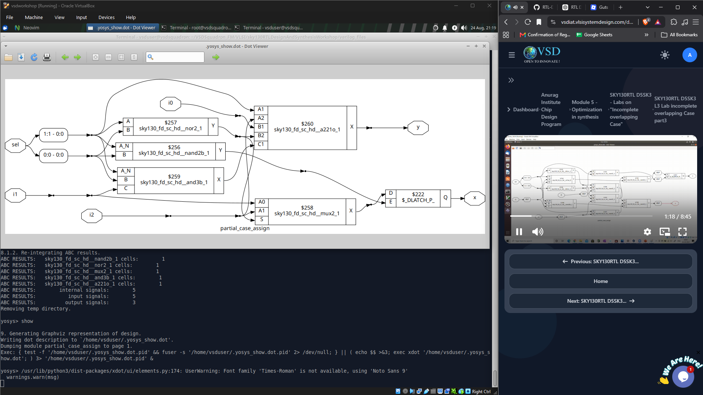

# Case Statements

## Objective

To understand how different `case` statement coding styles behave during simulation and synthesis, and to observe the effects of **complete, incomplete, overlapping, and partially assigned case statements**.

---

## Files Used

```text
comp_case.v
incomp_case.v
bad_case.v
partial_case_assign.v
```

---

## 1. Complete Case Statement

A complete `case` statement provides an assignment for every possible value of the select signal.

For a 2-bit select:

```text
00 → input 0
01 → input 1
10 → input 2
11 → input 3
```

This creates purely combinational logic because the output is defined for every possible condition.

The `comp_case.v` design was simulated and synthesized to observe the resulting behaviour.



The waveform shows that `y` changes according to the selected input as the `sel` value changes.

### Synthesized Result



The synthesized netlist contains combinational logic such as multiplexing and gate structures without an unintended latch.

---

## 2. Incomplete Case Statement

An incomplete `case` statement does not cover all possible select values.

For example:

```verilog
case (sel)
    2'b00: y = i0;
    2'b01: y = i1;
endcase
```

The cases `10` and `11` are not covered.

When these conditions occur, `y` has no new assignment and therefore must retain its previous value.

```text
Incomplete case
      ↓
Output must retain previous value
      ↓
Latch inference
```

The `incomp_case.v` design demonstrates this behaviour.



The output remains unchanged for select values that are not explicitly handled.

### Synthesized Result



The synthesized design contains a latch because the output is required to hold its previous value for uncovered cases.

---

## 3. Overlapping / Bad Case

The `bad_case.v` design was used to demonstrate an overlapping or improperly structured case condition.

In a normal `case` statement, the first matching condition is selected. Poorly defined or overlapping conditions can therefore create unexpected priority behaviour.

The design was simulated and its waveform was observed using GTKWave.



The waveform demonstrates the effect of the overlapping conditions on the output.

The synthesized structure can also differ from the intended simple multiplexer because the synthesis tool must preserve the behaviour described by the RTL.



---

## 4. Partial Case Assignment

A case statement may also assign only part of a variable.

For example, different branches may assign some bits while leaving other bits unchanged.

```text
Partial assignment
        ↓
Some bits are not assigned
        ↓
Unassigned bits retain previous values
        ↓
Possible latch inference
```

The `partial_case_assign.v` design demonstrates this behaviour.



The synthesized netlist shows the additional storage/combinational structures required to preserve the unassigned values.

---

## 7. Key Observations

- A **complete case** produces combinational logic when all conditions are assigned.
- An **incomplete case** can infer a latch.
- Missing assignments cause the output to retain its previous value.
- Overlapping or poorly structured conditions can introduce unexpected priority behaviour.
- Partial assignments can also lead to storage elements.
- A `default` case helps ensure complete assignment.
- Yosys converts the RTL `case` behaviour into actual gates, multiplexers, and, when required, latches.

---

## Key Takeaways

```text
Complete Case
    → Combinational logic

Incomplete Case
    → Output holds previous value
    → Possible latch inference

Partial Assignment
    → Some bits retain previous values
    → Possible latch inference

Default Case
    → Covers unspecified conditions
    → Helps avoid unintended latches
```

---

## Learning Outcomes

- Understood how `case` statements are used to describe combinational selection logic.
- Observed complete and incomplete case behaviour using GTKWave.
- Identified latch inference caused by incomplete assignments.
- Understood how case statements are converted into multiplexers and gate-level logic during synthesis.
- Learned the importance of `default` and complete assignments in combinational RTL.
